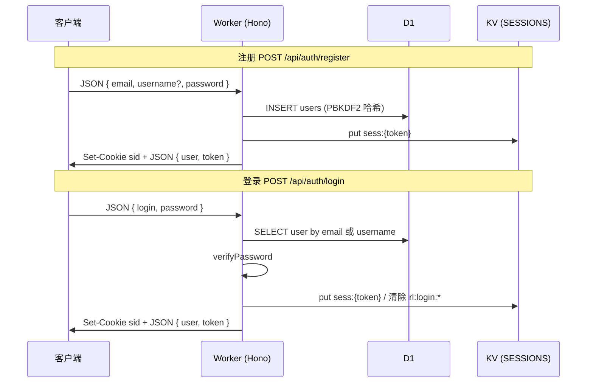
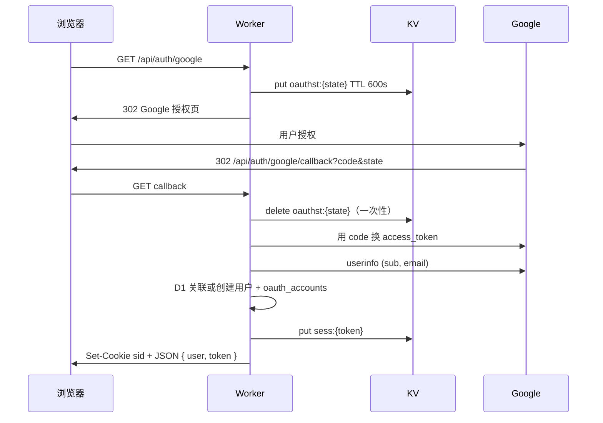

# 后端认证系统说明（Cloudflare Workers + Hono）

本文档对应 `packages/backend/src` 下的身份认证实现，便于后续 Agent 或维护者快速接手。

---

## 1. 系统架构概览

| 组件                                | 职责                                                                                                                         |
| ----------------------------------- | ---------------------------------------------------------------------------------------------------------------------------- |
| **Cloudflare Workers**              | 运行 Hono 应用，处理 HTTP 请求                                                                                               |
| **Hono**                            | 路由、`/api/*` 中间件、JSON 响应、Cookie                                                                                     |
| **D1**                              | 持久化 `users`、`oauth_accounts`                                                                                             |
| **Workers KV（绑定名 `SESSIONS`）** | Session 令牌、OAuth `state`、登录失败计数（限流）                                                                            |
| **环境变量 / Secrets**              | `APP_URL`、可选 `DEV`；敏感项通过 `wrangler secret`、Dashboard 或 **Secrets Store** 注入 Worker 环境（代码中不出现真实密钥） |

敏感配置（`GOOGLE_CLIENT_ID`、`GOOGLE_CLIENT_SECRET`、可选 `SESSION_PEPPER`）应通过 Cloudflare 侧注入：本地开发使用 `packages/backend/.dev.vars`（参考 `.dev.vars.example`），生产使用 `wrangler secret put` 或与 **Secrets Store** 集成后在 Worker 环境绑定同名变量。

---

## 2. 认证流程图

### 2.1 邮箱 / 用户名 + 密码注册与登录

### 2.2 Google OAuth 2.0

---

## 3. 数据库表结构（D1）

### `users`

| 字段                        | 说明                                         |
| --------------------------- | -------------------------------------------- |
| `id`                        | 主键                                         |
| `email`                     | 邮箱，唯一（NOCASE）                         |
| `username`                  | 可选展示名，唯一（可空）                     |
| `password_hash`             | PBKDF2-SHA256 存储串；纯 OAuth 用户为 `NULL` |
| `email_verified`            | 0/1                                          |
| `created_at` / `updated_at` | UTC 文本时间                                 |

### `oauth_accounts`

| 字段                  | 说明                          |
| --------------------- | ----------------------------- |
| `id`                  | 主键                          |
| `user_id`             | 外键 → `users.id`，级联删除   |
| `provider`            | 如 `google`                   |
| `provider_account_id` | 第三方主键（如 Google `sub`） |
| `created_at`          | 创建时间                      |

约束：`(provider, provider_account_id)` 唯一。

---

## 4. API 端点列表

基础路径：`/api/auth`（仍受全局 `/api/*` 中间件约束：仅 **GET/POST**，无宽松 CORS）。

| 方法 | 路径                        | 入参                                                                      | 成功响应 `data` 概要                       |
| ---- | --------------------------- | ------------------------------------------------------------------------- | ------------------------------------------ |
| POST | `/api/auth/register`        | JSON：`email`，`password`（≥8），可选 `username`（3–32 位字母数字下划线） | `{ user, token }`，201                     |
| POST | `/api/auth/login`           | JSON：`login`（邮箱或用户名），`password`                                 | `{ user, token }`                          |
| POST | `/api/auth/logout`          | Cookie：`sid` 可选                                                        | `{ loggedOut: true }`                      |
| GET  | `/api/auth/me`              | Cookie：`sid`                                                             | `{ user }`                                 |
| GET  | `/api/auth/google`          | 无                                                                        | 302 跳转 Google；未配置 Client 时 503 JSON |
| GET  | `/api/auth/google/callback` | Query：`code`，`state`                                                    | `{ user, token }`                          |

统一 JSON 外壳见 `jsonSuccess` / `jsonError`（`code`、`success`、`message`、`data`）。

---

## 5. 关键实现说明

### 5.1 Token / Session 生命周期

- 登录、注册、OAuth 回调成功后生成随机 `token`，KV 键：`sess:{token}`，值：`{ userId, exp }`，**TTL 7 天**（与 Cookie `Max-Age` 一致）。
- 响应体中同时返回 `token`，便于非浏览器客户端；浏览器侧通过 **`HttpOnly` Cookie `sid`** 携带会话。
- 登出：删除 KV 中对应键并清除 Cookie。

### 5.2 KV 存储策略

| 键前缀                 | 用途                        | TTL     |
| ---------------------- | --------------------------- | ------- |
| `sess:{token}`         | 已登录会话                  | 7 天    |
| `oauthst:{state}`      | OAuth CSRF `state`          | 10 分钟 |
| `rl:login:{clientKey}` | 登录失败次数（按客户端 IP） | 15 分钟 |

### 5.3 Secrets 使用方式

- **禁止**在仓库中提交真实 `GOOGLE_CLIENT_ID`、`GOOGLE_CLIENT_SECRET`、`SESSION_PEPPER`。
- 生产：`wrangler secret put GOOGLE_CLIENT_ID` 等，或在 Dashboard / **Secrets Store** 配置后映射为 Worker 环境变量（与 `Bindings` 字段名一致）。
- 本地：复制 `.dev.vars.example` 为 `.dev.vars` 并填写。
- `APP_URL` 在 `wrangler.toml` 的 `[vars]` 中配置，**OAuth 重定向 URI** 必须为：
  `{APP_URL}/api/auth/google/callback`（与 Google Cloud Console 中配置一致）。

### 5.4 密码存储

- 使用 **Web Crypto PBKDF2-SHA256**（Workers 原生，无额外 npm 密码学依赖），格式：`pbkdf2_sha256$<iter>$<salt_hex>$<hash_hex>`。
- 可选 `SESSION_PEPPER` 在哈希前拼入密码，增强泄露场景下的防护（仍须通过 Secret 注入）。

---

## 6. 注意事项 / 坑点

1. **迁移**：`wrangler d1 migrations apply <database_name> --local`（本地）或加 `--remote`（远程）。
2. **Google Console**：授权重定向 URI 必须与 `APP_URL` 完全一致（含 http/https 与端口）。
3. **OAuth 回调**：当前实现返回 **JSON**；若前端为纯浏览器应用，可能需要改为 302 到前端页面或提供 `redirect` 参数（当前未实现，需自行扩展）。
4. **API CORS**：现有 `/api/*` 中间件**不放宽跨域**，同站或反向代理访问更匹配当前设计。
5. **Secrets Store**：若团队使用 Cloudflare Secrets Store，将密钥集中管理后，在 Worker 绑定阶段映射为 `GOOGLE_CLIENT_ID` 等名称即可，**无需改业务代码**，只要环境变量名一致。

---

## 7. 相关源码路径（速查）

- 入口与路由挂载：`src/index.ts`
- 认证路由：`src/routes/auth.ts`
- 密码学：`src/auth/password.ts`
- 会话：`src/auth/session.ts`
- Google：`src/auth/google-oauth.ts`
- 登录限流：`src/auth/rate-limit.ts`
- 环境类型：`src/env.ts`
- SQL 迁移：`migrations/0001_init.sql`
